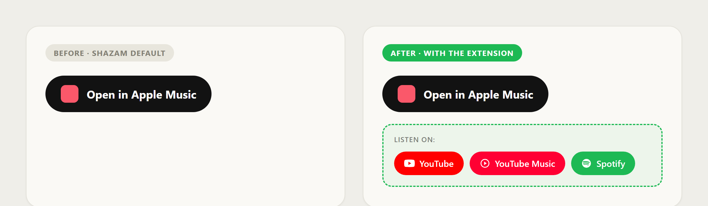

# Open Anywhere for Shazam

A lightweight browser extension that adds **YouTube**, **YouTube Music** and
**Spotify** buttons to song pages on [shazam.com](https://www.shazam.com),
right next to the existing Apple Music button.

Shazam is owned by Apple, so its song pages almost always link to Apple Music
only. This extension adds the links most people actually want — without any
account, API key, or audio recognition.



## Why

When you open a song on `shazam.com`, the result page links to Apple Music and,
~10% of the time, YouTube. The other ~90% of the time there is no YouTube link.
This extension fills that gap on every song page.

The buttons open a **search** (`"artist title"`) on each service rather than a
single fixed video — intentionally. On YouTube the same song has covers, live
versions, lyric videos and remixes, so letting you pick the right result is more
reliable than guessing one.

## How it works

- A content script runs only on `shazam.com/song/...` pages.
- It reads the artist and title already present on the page (language-independent:
  it uses the visible artist link + `document.title`, with metadata fallbacks).
- It injects the buttons into Shazam's music-buttons container, with fallbacks
  (next to the Apple Music button, or a floating button) if Shazam changes its
  markup.
- It handles Shazam's single-page-app navigation, re-injecting when you move to
  another song without a full reload.

No data is collected or sent anywhere. See [PRIVACY.md](PRIVACY.md).

## Browser compatibility

It is a single Manifest V3 package using only a content script and the DOM — no
browser-specific APIs — so the same build runs everywhere:

| Browser | Supported | Notes |
|---|---|---|
| Chrome | ✅ | Load unpacked or via Chrome Web Store |
| Edge | ✅ | Load unpacked or via Edge Add-ons |
| Brave / Opera / Vivaldi / Arc | ✅ | Chromium-based, same package |
| Firefox | ✅ | Works on `shazam.com`; see note below |

> **Firefox note:** the extension itself works on `shazam.com` in Firefox. But
> Firefox has **no official Shazam extension** to identify songs (that one is
> Chromium-only). On Firefox you reach a `shazam.com` song page by browsing the
> site directly, or via an unofficial recognizer that links out to `shazam.com`.

## Install (developer mode)

**Chromium (Chrome, Edge, Brave, Opera, Vivaldi, Arc):**

1. Open `chrome://extensions` (or `edge://extensions`).
2. Enable **Developer mode**.
3. Click **Load unpacked** and select this folder.
4. Open any song on `shazam.com` — the buttons appear under "Listen on:".

> Chromium may show a harmless warning about the `browser_specific_settings`
> key (it's there for Firefox and is safely ignored by Chromium).

**Firefox (temporary install):**

1. Open `about:debugging#/runtime/this-firefox`.
2. Click **Load Temporary Add-on** and select `manifest.json` in this folder.
3. (Temporary add-ons are removed on restart; permanent install requires signing
   via addons.mozilla.org.)

## Get the source

```bash
git clone https://github.com/polvora/open-anywhere-for-shazam.git
cd open-anywhere-for-shazam
```

## Publishing

| Store | Cost | Link |
|---|---|---|
| Chrome Web Store | one-time **$5** developer fee | https://developer.chrome.com/docs/webstore/register |
| Microsoft Edge Add-ons | **free** | https://developer.microsoft.com/microsoft-edge/extensions/ |
| Firefox (AMO) | **free** | https://addons.mozilla.org/developers/ |

Before publishing:

1. If you fork this, update `homepage_url` in `manifest.json` and the repo links to your GitHub user.
2. Update the copyright name in `LICENSE` if needed.
3. Zip the folder contents (not the parent folder) and upload to each store.
   Each store has its own review; the same zip works for all of them.

## Customize

- **Remove a service:** delete its object from the `SERVICES` array in `content.js`.
- **YouTube only:** keep just the `youtube` object in `SERVICES`.
- **Change the "Listen on:" label:** edit `_locales/en/messages.json` and
  `_locales/es/messages.json`.

## Project structure

```
manifest.json        MV3 config (universal Chromium + Firefox)
content.js           extraction + injection logic
styles.css           button styles
_locales/en, /es     UI localization
icons/               16 / 48 / 128 px icons
docs/screenshot.png  store / README screenshot
```

## Disclaimer

Unofficial project. Not affiliated with or endorsed by Apple, Shazam, YouTube,
Google, or Spotify. "Shazam" is a trademark of Apple Inc.; other names are
trademarks of their respective owners.

## License

[MIT](LICENSE)
